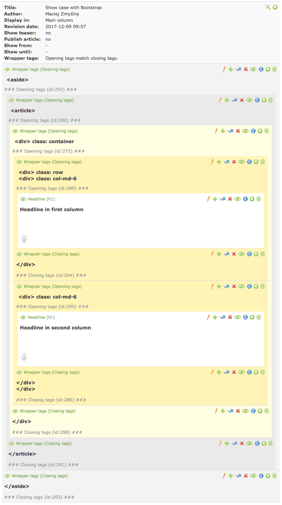

wrapper_tags 
===============================
An extension for [Contao Open Source CMS](https://contao.org/en/)
 
Provides content elements that help build html structure with ease (e.g. for Bootstrap). Shows instant **validation** of the resulting html structure. Uses **colors** to visualize the structure.

## System requirements
- Contao 3.2.x - 3.5.x | 4.4+
- PHP 5.6.2 - 7.x

Not tested on PHP &lt; 5.6.2 but maybe works on few earlier versions.


## Installation

```bash
  $ composer require zmyslny/contao-wrapper_tags
```
Using [Contao extension catalog](https://contao.org/en/extension-list/view/wrapper_tags.10020019.en.html "Contao extension catalog")


## Building HTML structure

**Old way**

When someone wants to wrap content elements with e.g. `<div class="col-md-6"> </div>` he usually goes for 2 "custom-template.html5" (one to open div and second to close it) or enter HTML directly in HTML-element (in its HTML code field).

**Wrapper tags way**

All just by clicking.

Open `<div>` or `<span>` or any other html tag using special opening element named `Opening tags` and then close these tags using closing element `Closing tags`. 

They allow to enter custom classes, id or styles on each opened single html tag. One `Opening tags` element allows to open many html tags at ones. The same applies to `Closing tags` element. It can close many html tags.

You can open 2 html tags in one `Opening tags` element and close them using 2 separate `Closing tags` elements. All 3 will be indented at the same level! And of course insert content between each of them.

Indents are preserved even in the paging view.

**Validation**. The great advantage of using these content elements is that you always see validation status of resulting structure. If there is any html error it will show you where exactly and what kind of a problem there is. Validation takes into account other wrapper elements like e.g. `Accordion` or `Content slider`.

**Colors tip**: content elements indented more then 1 level are colored by default. You can switch this functionality off in settings.


## Example screenshots

### Show case structure


### ... with ERROR validation status


### `Opening tags` content element


### `Closing tags` content element


### Indents and colors in paging


### Settings


## Copyright
Created and maintained by [Maciej](http://contao-developer.pl).
