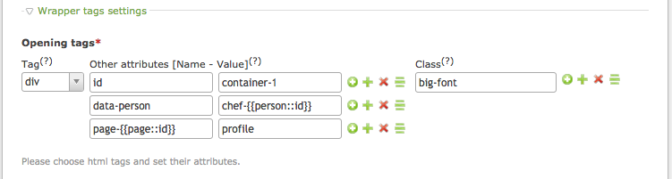
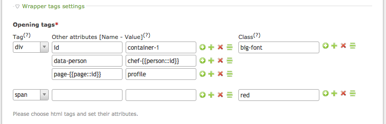
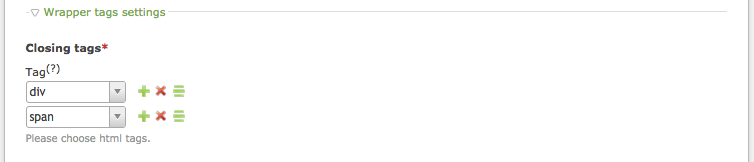
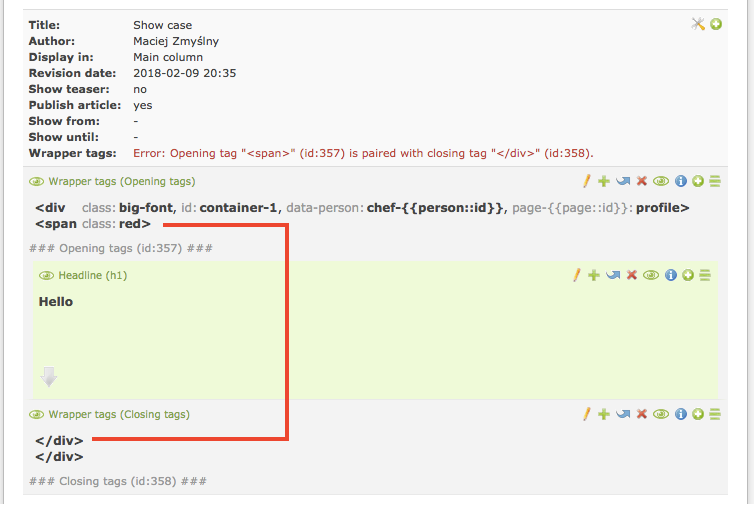
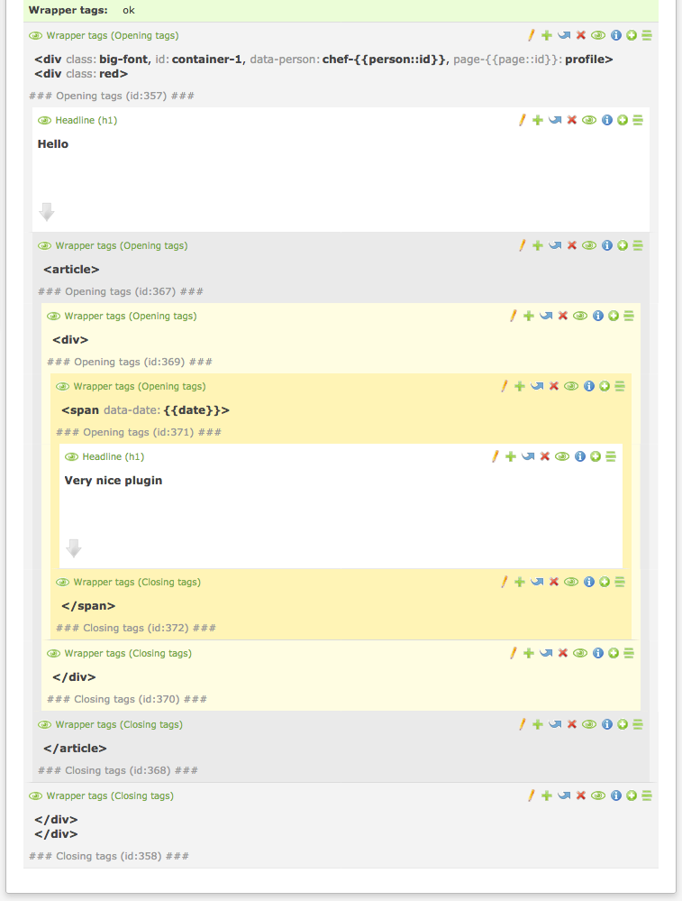
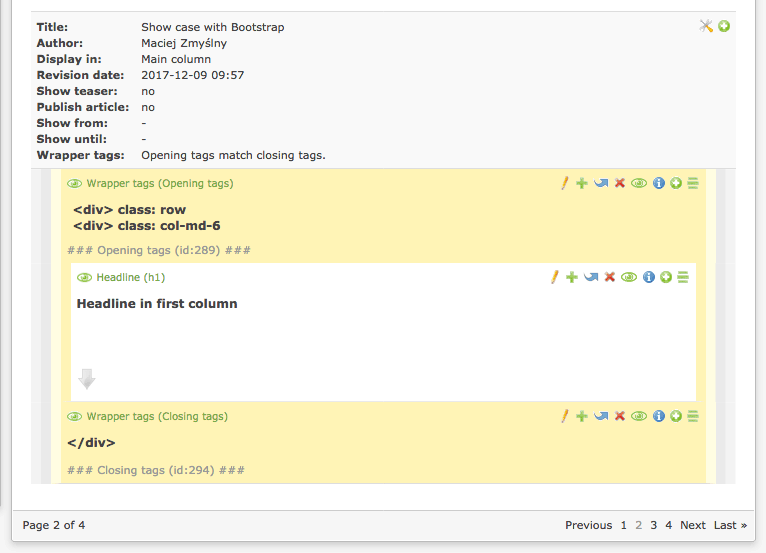
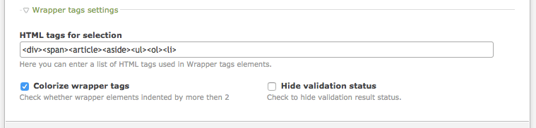

wrapper_tags 
===============================
An extension for [Contao Open Source CMS](https://contao.org/en/)
 
Provides content elements for building any html structure without a need for using the templates.

## System requirements
- Contao 3.2.x - 3.5.x, 4.4+
- PHP 5.6.2 - 7.x

Not tested with PHP &lt; 5.6.2 but probably works with few earlier versions.


## Installation

```bash
  $ composer require zmyslny/contao-wrapper_tags
```
Using [Contao extension catalog](https://contao.org/en/extension-list/view/wrapper_tags.10020019.en.html "Contao extension catalog")


## Building HTML structure

All just by clicking.

### Use `Opening tags` content element to open any HTML tag with any desire attribute.



### The `Opening tags` element allows to add multiple tags at once.



### Use `Closing tags` content element to close HTML tags.



### You will be notified of any possible error in the structure you have built.



### The elements behave as the smart wrapping Contao elements.



### The indents and colors are preserved even in paging.


### Settings


## Copyright
Created and maintained by [Maciej](http://contao-developer.pl).
