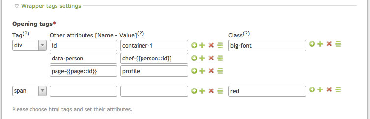
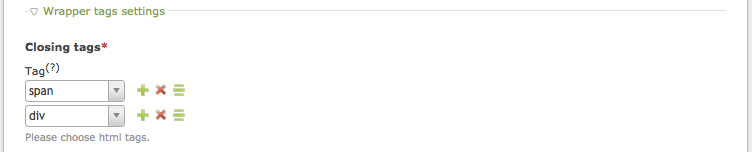
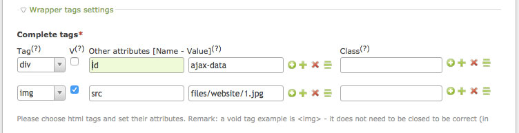
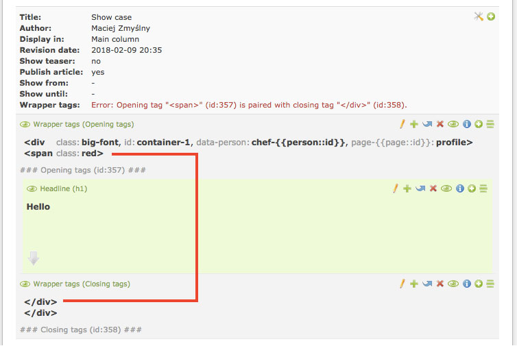
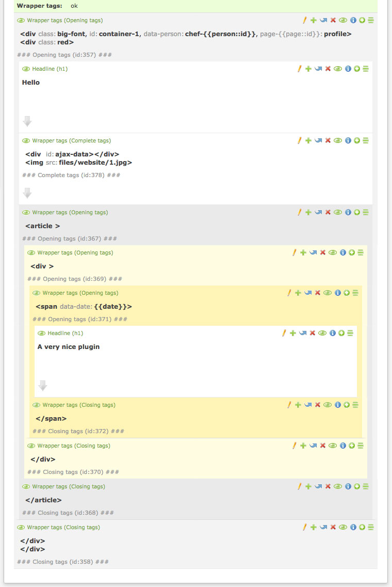
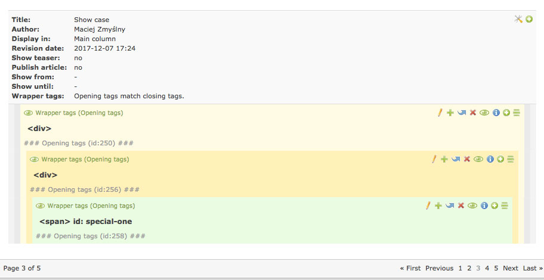
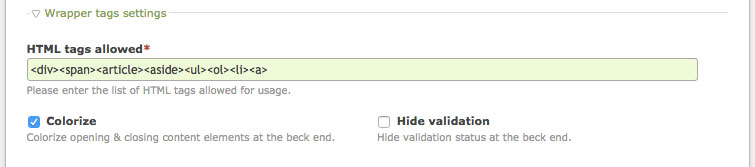

wrapper_tags 
===============================
An extension for [Contao Open Source CMS](https://contao.org/en/)
 
Provides content elements for building any html structure in an article without a need for using templates.

## System requirements
- Contao 3.2.x - 3.5.x, 4.4+
- PHP 5.6 - 7.x 

Not tested with Contao 4.0 - 4.3 but probably works with them.
Not tested with PHP &lt; 5.6 but probably works with few earlier versions.


## Installation

```bash
  $ composer require zmyslny/contao-wrapper_tags
```
Using [Contao extension catalog](https://contao.org/en/extension-list/view/wrapper_tags.20000009.en.html "Contao extension catalog")


## Building HTML structure

All just by clicking.

### The `Opening tags` element allows to add multiple tags at once. 

Every tag can have any desire attribute. Insert tags are allowed to form attributes names & values.



The code result in the front end:

```html
<div class="big-font" id="container-1" data-person="chef-12" page-5="profile">
<span class="red">
```

### Use `Closing tags` content element to close HTML tags.



The code result in the front end:

```html
</div>
</span>
```

### Use `Complete tags` content element to add complete HTML tags.



The code result in the front end:

```html
<div id="ajax-data"></div>

```

### You will be notified of any possible error in the structure you have built.



### The elements behave as wrapper elements.

They are indented and specially colored at deeper levels.



The code result in the front end:

```html
<div id="container-1" data-person="chef-12" page-5="profile" class="big-font">
    <div class="red">
        <h1 class="ce_headline">Hello</h1>
        <div id="ajax-data"></div>
        
        <article>
            <div>
                <span data-date="13/02/2018">
                    <h1 class="ce_headline">Very nice plugin</h1>
                </span>
            </div>
        </article>
    </div>
</div>
```

### The indents and colors are preserved even in the paging mode.


### Settings


## Copyright
Created and maintained by [Mike](http://contao-developer.pl).
